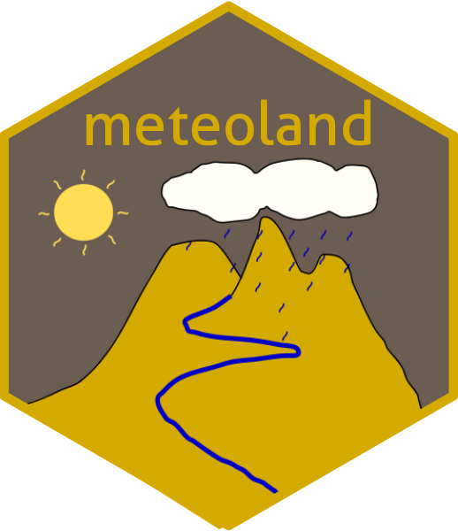

```{r setup, echo = FALSE}
knitr::opts_chunk$set(collapse = TRUE, comment = "#>", fig.path = "README-")
knitr::opts_chunk$set(fig.path = "man/figures/")
```

# Landscape meteorology tools <a href="https://emf-creaf.github.io/meteoland/"></a>

[](https://cran.r-project.org/package=meteoland)
[](https://cran.rstudio.com/web/packages/meteoland/index.html)
[](https://github.com/emf-creaf/meteoland/actions)

## Introduction

With the aim to assist research of climatic impacts on forests, the R
package `meteoland` provides utilities to estimate daily weather
variables at any position over complex terrains:

-   Spatial interpolation of daily weather records from meteorological
    stations.
-   Statistical correction of meteorological data series (e.g. from
    climate models). Note that this functionality is deprecated starting in version 2.0.0. 
-   Multisite and multivariate stochastic weather generation. Note that this functionality is deprecated starting in version 2.0.0. 

A more detailed introduction to the package functionality can be found
in De Cáceres et al. (2018). 

## Important notice

Starting on June 2023, `rgdal`, `rgeos` and `maptools` R packages entered a *maintenance* mode (meaning no new updates, more info at
<https://github.com/r-spatial/evolution>). Coincidentally, `sp` and
`raster` packages are now superseded by the more modern alternatives
`sf`, `stars` and `terra`. This means that the `meteoland` classes,
which are based on `sp`, need to be updated to deal with these changes
in the R-spatial ecosystem.

Starting with version 2.0.0 of `meteoland` (February 2023) **all
functions, methods and classes based on or using the `sp`, `raster` and
`rgdal` package were soft-deprecated**. 

> **Since ver. 2.0.1, these functions, methods and classes were
> hard-deprecated, meaning they stopped working.**

> **Since ver. 2.1.0, these functions, methods and classes have
> been removed from the package**

See the [*Tidy
meteoland*](https://emf-creaf.github.io/meteoland/articles/tidy-meteoland.html)
vignette (`vignette("tidy-meteoland", package = "meteoland")`) for more
info about this changes.


## Package installation and documentation

Package **meteoland** can be found at [CRAN](https://cran.r-project.org/),
but the version in this repository may not be the most recent one.
Latest stable versions can be downloaded and installed from GitHub as
follows (package `remotes` should be installed first):

```{r installation, eval = FALSE}
remotes::install_github("emf-creaf/meteoland")
```

Alternatively, users can have help to run package functions directly as
package vignettes, by forcing their inclusion in installation:

```{r installation vignettes, eval = FALSE}
remotes::install_github("emf-creaf/meteoland", 
                        build_opts = c("--no-resave-data", "--no-manual"),
                        build_vignettes = TRUE)
```

Detailed documentation on **meteoland** calculation routines can be found
at (<https://emf-creaf.github.io/meteolandbook/index.html>).

## Companion packages

### Package meteospain

During the development of **meteoland** some functions to download weather
station data from several Spanish networks were originally developed.
After **meteoland** version 1.0.1, the user is recommended to use package
[**meteospain**](https://emf-creaf.github.io/meteospain/), which can
also be found at
[CRAN](https://cran.rstudio.com/web/packages/meteospain/index.html).
Functions to download weather station data are still available in
**meteoland** but they have been deprecated and make internal calls to
functions in package
[**meteospain**](https://emf-creaf.github.io/meteospain/).

### Packages medfate and medfateland

Package **meteoland** has been designed to provide input weather data for simulations of forest function and dynamics via the following packages

  + Package [**medfate**](https://emf-creaf.github.io/medfate) provides functions for simulating forest function and dynamics.
  + Package [**medfateland**](https://emf-creaf.github.io/medfateland) extends **medfate** by allowing simulations to be performed in a spatially explicit context.

## Authorship

R package **meteoland** is developed and maintained by the [*Ecosystem
Modelling Facility*](https://emf.creaf.cat) at CREAF (Catalonia, Spain).

## References

-   De Caceres M, Martin-StPaul N, Turco M, Cabon A, Granda V (2018)
    Estimating daily meteorological data and downscaling climate models
    over landscapes. Environmental Modelling and Software 108: 186-196.
    (<doi:10.1016/j.envsoft.2018.08.003>).
